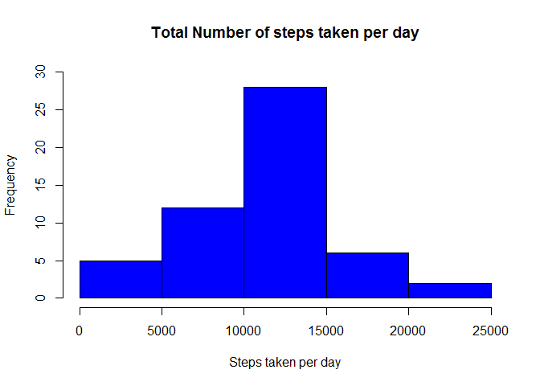
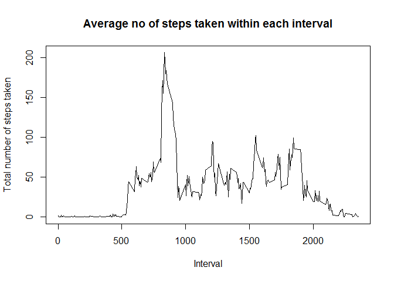
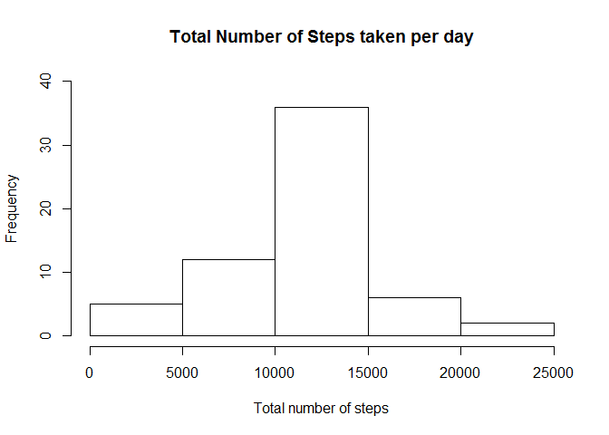
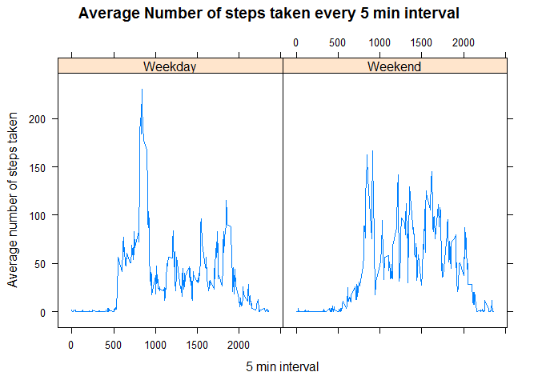

Loading and Preprocessing the Data
----------------------------------

The csv file is downloaded from the website and stored under the data variable. The data is then preprocessed by removing the "NA" values and this preprocessed data is stored into the newdata variable

``` r
temp<-tempfile()
download.file("https://d396qusza40orc.cloudfront.net/repdata%2Fdata%2Factivity.zip",temp)
data<-read.csv(unz(temp,"activity.csv"))
unlink(temp)
newdata<-subset(data,steps != "NA")
```

Mean total number of steps taken per day
----------------------------------------

### Total Number of days taken per day

The variable dailysteps stores the total number of steps taken each day

``` r
dailysteps<-aggregate(newdata$steps,list(newdata$date),sum)
head(dailysteps)
```

    ##      Group.1     x
    ## 1 2012-10-02   126
    ## 2 2012-10-03 11352
    ## 3 2012-10-04 12116
    ## 4 2012-10-05 13294
    ## 5 2012-10-06 15420
    ## 6 2012-10-07 11015

### Histogram of total number of steps taken every day

``` r
hist(dailysteps$x,main="Total Number of steps taken per day",xlab="Steps taken per day",ylim=c(0,30),col="blue")
```



### Mean and Median of steps taken every day

``` r
meansteps<-mean(dailysteps$x)
print(meansteps)
```

    ## [1] 10766.19

``` r
mediansteps<-median(dailysteps$x)
print(mediansteps)
```

    ## [1] 10765

The mean and median functions are used. Mean is 1.076618910^{4}. Median is 10765

Average Daily Activity Pattern
------------------------------

### Averaged time series plot of 5 min interval

``` r
dailysteps2<-aggregate(newdata$steps,list(newdata$interval),mean)
plot(dailysteps2$Group.1,dailysteps2$x,type='l',main="Average no of steps taken within each interval",xlab="Interval",ylab="Total number of steps taken")
```



### Interval with maximum number of steps

``` r
y<-which.max(dailysteps2$x)
z<-dailysteps2[y,1]
print(z)
```

    ## [1] 835

The interval is 835

Imputing missing data values
----------------------------

### Calculate total number of missing values

is.na function is used to calculate total number of missing values

``` r
miss<-subset(data,is.na(steps))
ab<-nrow(miss)
print(ab)
```

    ## [1] 2304

Total number of missing values is 2304.

### Fill in missing values and create a new dataset

In this case the average 5 min interval values obtained earlier (dailysteps2 variable) is used to fill in the missing value. rbind is used to combine this filled in value with the dataset without NA values. This new dataset is called combinedata.

``` r
for(i in 1:2304){
    y<-which(dailysteps2[,1]==miss[i,3])
    miss[i,1]<-as.numeric(dailysteps2[y,2])
}
combinedata<-rbind(miss,newdata)
head(combinedata)
```

    ##       steps       date interval
    ## 1 1.7169811 2012-10-01        0
    ## 2 0.3396226 2012-10-01        5
    ## 3 0.1320755 2012-10-01       10
    ## 4 0.1509434 2012-10-01       15
    ## 5 0.0754717 2012-10-01       20
    ## 6 2.0943396 2012-10-01       25

### Histogram of new dataset

``` r
combinedata$steps<-as.numeric(as.character(combinedata$steps))
dailysteps3<-aggregate(combinedata$steps,list(combinedata$date),sum)
hist(dailysteps3$x,main="Total Number of Steps taken per day",xlab="Total number of steps",ylim=c(0,40))
```



### Mean and Median of new dataset

``` r
mean2<-mean(dailysteps3$x)
print(mean2)
```

    ## [1] 10766.19

``` r
median2<-median(dailysteps3$x)
print(median2)
```

    ## [1] 10766.19

Mean is 1.076618910^{4}. Median is 1.076618910^{4}.

Differences between Weekdays and Weekends
-----------------------------------------

### Creating factor variable

Categorydata stores the factor variable whether a day is a weekday or weekend. The categorydata is then joined with the combinedata

``` r
whatday<-weekdays(as.Date(combinedata$date))
combinedata<-cbind(combinedata,whatday)
categorydata<-sapply(combinedata$whatday,function(x)if(x=="Sunday"|x=="Saturday"){categoryday<-as.factor("Weekend")}else{categoryday<-as.factor("Weekday")})
combinedata<-cbind(combinedata,categorydata)
```

### Panel plot

Use Lattice package to come up with panel plot

``` r
dailysteps4<-aggregate(combinedata$steps,list(combinedata$interval,combinedata$categorydata),mean)
library("lattice")
p<-xyplot(dailysteps4$x~dailysteps4$Group.1|dailysteps4$Group.2,type='l',main="Average Number of steps taken every 5 min interval",xlab="5 min interval",ylab="Average number of steps taken")
print(p)
```


